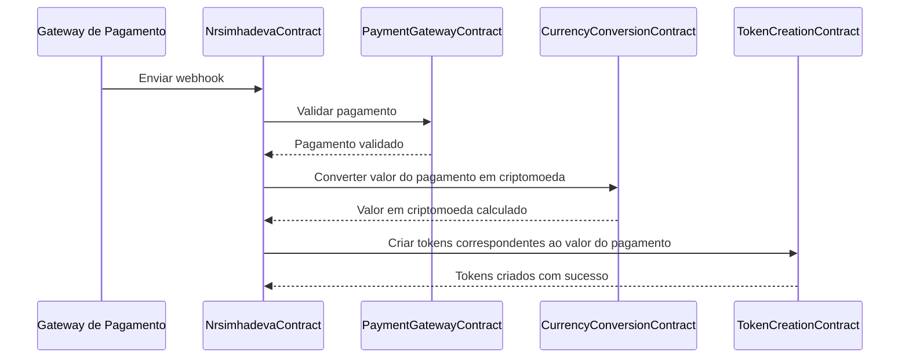

<br/>
<p align="center">
<a href="" target="_blank">

</a>
</p>
<br/>

# Nrsimhadeva

Nrsimhadeva é um protocolo que realiza a comunicação com um Gateway de pagamento que, ao receber um pagamento, converte o valor em criptomoeda.

## Índice
1. [Sobre](#sobre)
2. [Características](#características)
3. [Requisitos](#requisitos)
4. [Instalação](#instalação)
5. [Uso](#uso)
6. [Principais jornadas](#principais-jornadas)
7. [Como plugar seu projeto](#como-plugar-seu-projeto)
8. [Licença](#licença)

## Sobre
Nrsimhadeva é um protocolo inovador que facilita a conversão de moedas fiduciárias em criptomoedas. Ao receber um pagamento através de um Gateway de pagamento, o protocolo automaticamente converte o valor recebido em criptomoeda.

## Características
- Comunicação com Gateway de pagamento
- Conversão automática de moedas fiduciárias em criptomoedas
- Uso de Chainlink para validação de pagamentos

## Requisitos
- Node.js v14.x.x ou superior
- NPM v6.x.x ou superior
- Solidity v0.8.x
- Ethereum Virtual Machine (EVM) compatível com a rede blockchain

## Instalação
1. Clone o repositório:
\```
git clone https://github.com/seu-username/nrsimhadeva.git
\```
2. Navegue até a pasta do projeto:
\```
cd nrsimhadeva
\```
3. Instale as dependências:
\```
npm install
\```
4. Compile os contratos inteligentes:
\```
truffle compile
\```
5. Implemente os contratos inteligentes na rede blockchain escolhida:
\```
truffle migrate --network <nome_da_rede>
\```

## Uso
O protocolo Nrsimhadeva permite a integração com Gateways de pagamento para a conversão automática de moedas fiduciárias em criptomoedas. Consulte a documentação da API para mais informações sobre os endpoints disponíveis e exemplos de uso.

## Principais jornadas
- Gateway de Pagamento
- Webhook
- Criptomoedas
- Chainlink



## Como plugar seu projeto
Para integrar seu projeto com o protocolo Nrsimhadeva, siga as instruções disponíveis na documentação da API.

## Licença
Este projeto está licenciado sob a Licença MIT - veja o arquivo `LICENSE` para detalhes.
